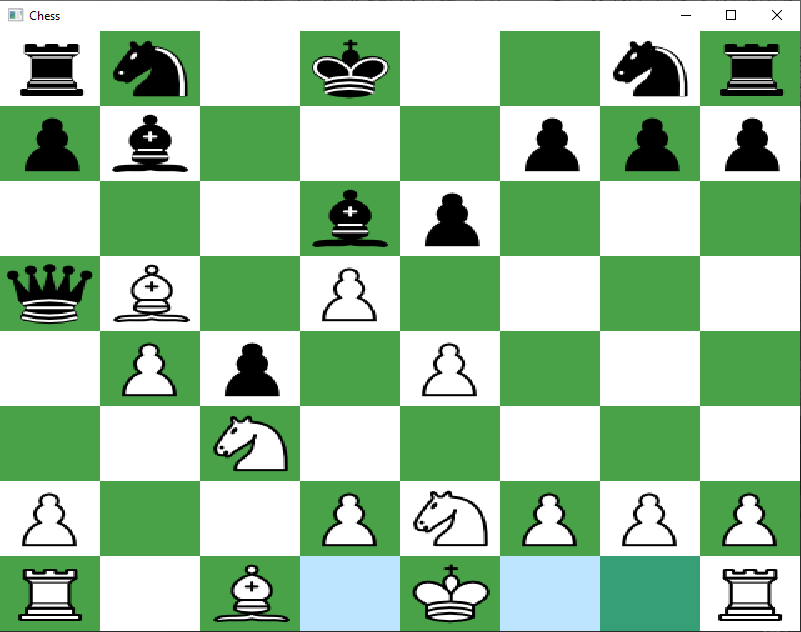

# Chess GUI

This is C++ app for Chess GUI.

## Future

- Сheck "Check" and "Checkmate"

- Show possible position for figure

- Rooking

- "Double-step" "En passant" "Promotion" for pawn

## Build

Need to edit .env.cmake for SDL2 library.